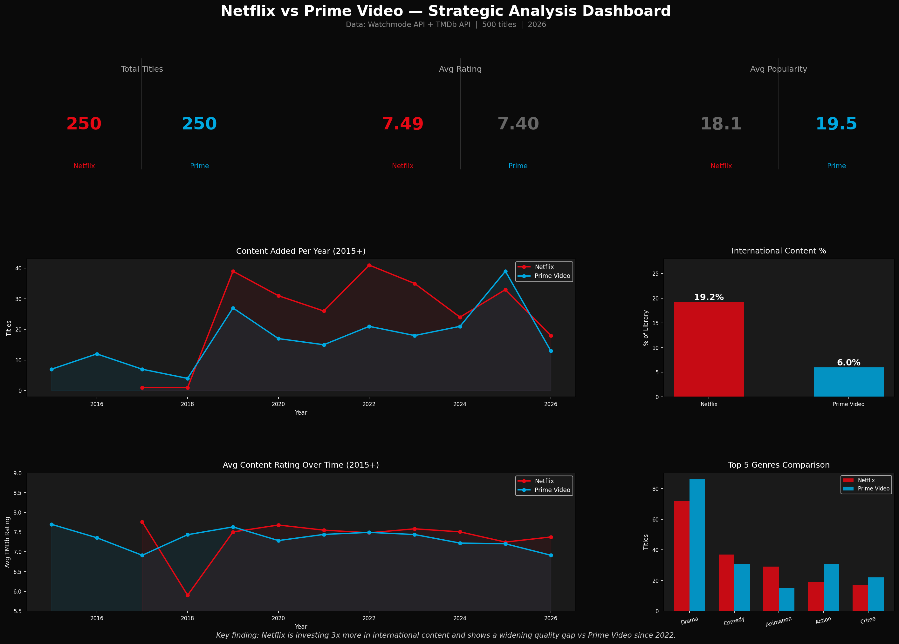
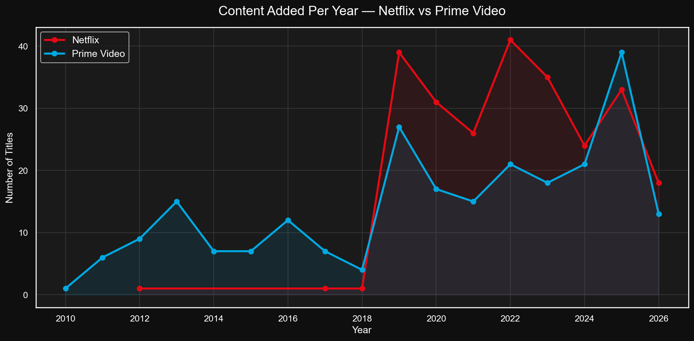
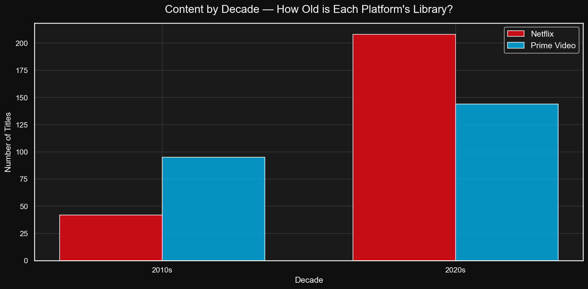
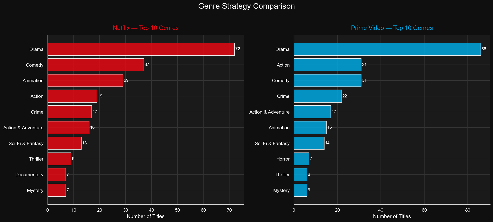
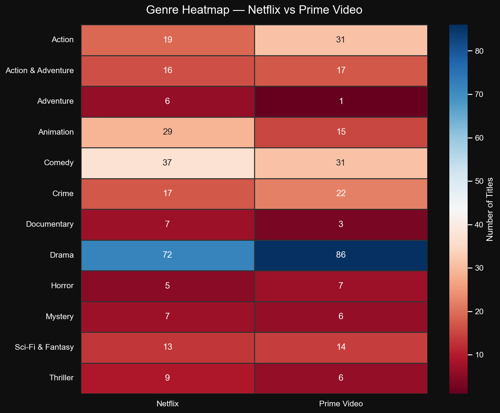
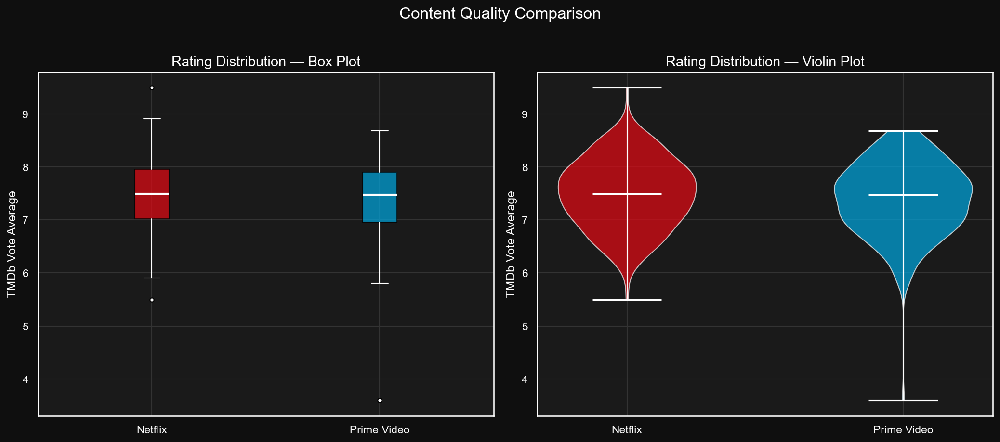
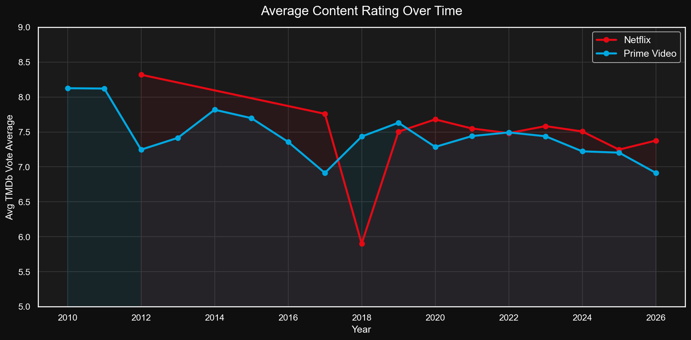
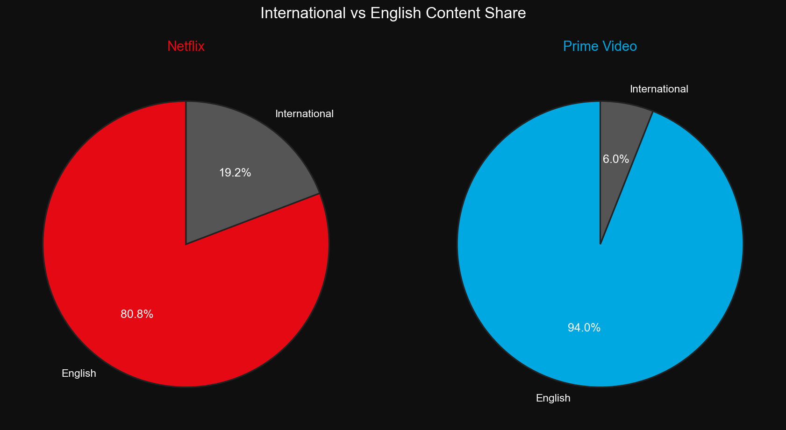
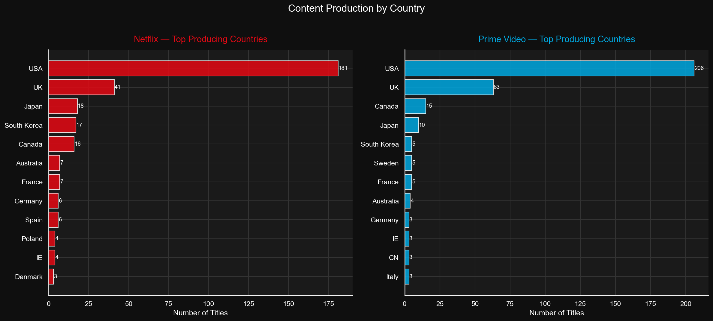
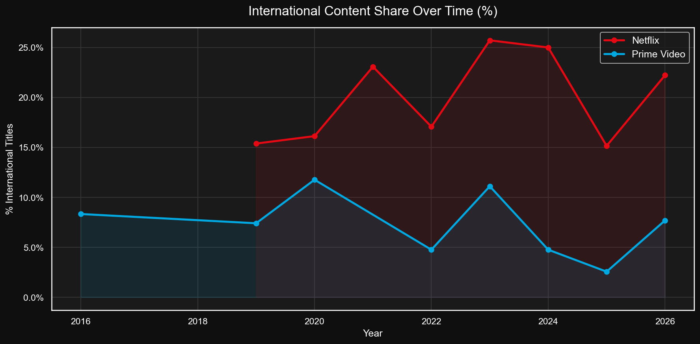

# 🎬 Netflix vs Prime Video — Content Strategy Analysis

> A data science project comparing Netflix and Amazon Prime Video using live API data,
> quantitative analysis, and an interactive Streamlit dashboard.

---

## 🧠 Project Thesis

**"Is Amazon Prime Video declining compared to Netflix?"**

Most streaming comparisons rely on outdated Kaggle CSVs. This project pulls
**live, current catalog data** directly from the Watchmode and TMDb APIs,
then runs quantitative analysis across content volume, genre strategy,
content quality, and international expansion to answer that question with data.

Part 2 (qualitative sentiment analysis via Reddit) is currently in progress.

---

## 🔍 Key Findings

| Metric | Netflix | Prime Video |
|---|---|---|
| Avg TMDb Rating | 7.49 | 7.40 |
| Avg Popularity Score | 18.1 | 19.5 |
| International Content | 19.2% | 6.0% |
| Animation Titles | 29 | 15 |
| Drama Titles | 72 | 86 |
| 2020s Content Share | 83% | 57% |

**The headline:** Netflix is investing 3x more in international content and shows
a widening quality trend gap vs Prime Video since 2022, despite both platforms
having statistically comparable overall ratings (p = 0.12, t-test).

---

## 📊 Analysis Breakdown

### 1. Platform Growth
Netflix had minimal catalog presence before 2019, then scaled aggressively.
Prime Video had an early lead through the 2010s but new title additions have
been flat and declining since 2025. Netflix's library is also significantly
more 2020s-focused (83% vs 57%) meaning fresher, more current content.

---

### 2. Genre Strategy
Both platforms are Drama heavy, but they diverge in meaningful ways. Netflix
invests more in Animation (29 vs 15), Comedy (37 vs 31), and Documentary
(7 vs 3). Prime Video leans harder into Action and Crime. The genre diversity
score is nearly identical. (18 vs 19 unique genres)  So it is not about
breadth, it is about where each platform concentrates its budget.

---

### 3. Ratings and Quality
Overall content quality is statistically comparable between the two platforms.
However the trend line tells a more nuanced story. Prime Video's average
rating has been on a downward trajectory since 2022, while Netflix has
held steady. Netflix also has fewer low-rated outliers (tighter distribution).

---

### 4. International Expansion
This is the sharpest strategic difference in the entire dataset. Netflix
dedicates 19.2% of its library to non-English content, with strong investment
in Japan (18 titles), South Korea (17), Spain (6), and Germany (6). Prime
Video sits at just 6.0% international, essentially a US/UK platform with
minimal global ambition. Netflix's international share has been climbing
consistently since 2019 while Prime's has stayed flat.

---

### 5. Summary Dashboard

---

## ✅ Verdict

The data partially supports the thesis. Prime Video is not declining in
raw content quality as ratings are statistically comparable. But it is
losing ground in three critical dimensions:

- **Content momentum** : fewer new titles since 2025, older library
- **International strategy** : 3x less global content than Netflix
- **Rating trajectory** : downward trend since 2022 vs Netflix holding steady

Netflix is building a global content platform. Prime Video is consolidating
around English-speaking markets with a library that is aging faster.

---

## ⏳ Part 2 — Coming Soon

Reddit API access is currently pending. Part 2 will add:

- Audience sentiment analysis using VADER and TextBlob
- Topic modeling (LDA) on r/netflix and r/primevideo
- Word clouds showing what audiences love vs complain about on each platform
- A qualitative narrative layer on top of this quantitative foundation

---

## 🔧 Tech Stack

| Category | Tools |
|---|---|
| Data Collection | Watchmode API, TMDb API |
| Processing | Python, Pandas, NumPy |
| Visualization | Matplotlib, Seaborn, Plotly |
| Statistical Testing | SciPy (independent t-test) |
| Dashboard | Streamlit |
| Part 2 (coming) | PRAW, VADER, TextBlob, scikit-learn |

---
## 📡 Data Sources

- **Watchmode API** : live streaming catalog data (Netflix source ID: 203, Prime source ID: 26)
- **TMDb API** : title metadata including ratings, genres, runtime, and production countries
- 500 titles collected, enriched, and analyzed (250 per platform)

---